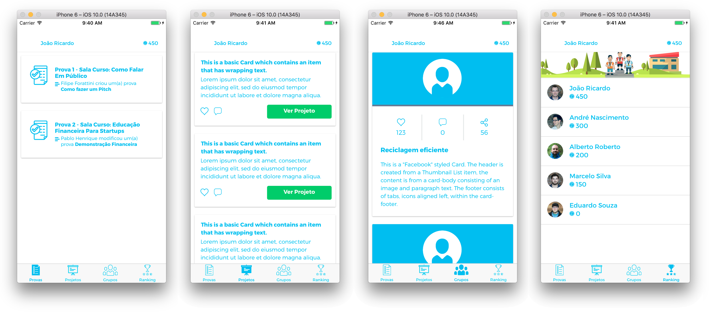

IAMAR Hackathon Project
=====================

This is an ionic based project. It was used to create a project for the IAMAR organization. This porject won the second place on IAMAR Hackathon.

## Using this project

First of all, isntall cordova & ionic:
```bash
$ npm i -g cordova ionic@1.7.0
```

Then install the project dependencies:
```bash
$ cd IAMAR-Hackathon-Project && npm i
```

To start this project and run it on Google Chrome:

```bash
$ ionic serve
```

Or run it on an emulator:

```bash
$ ionic run
```


## How does it look?

